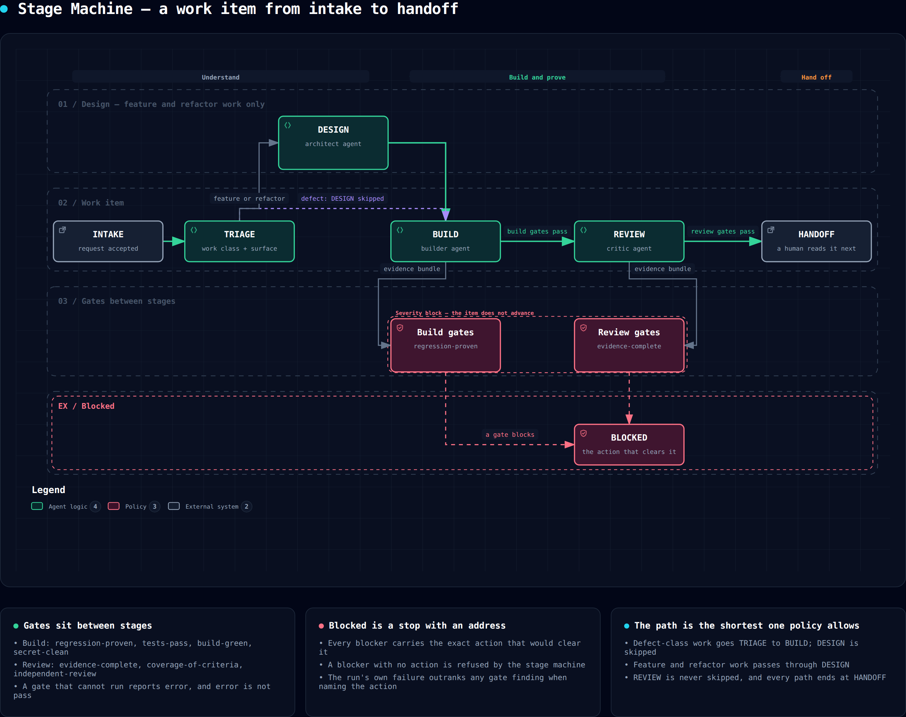
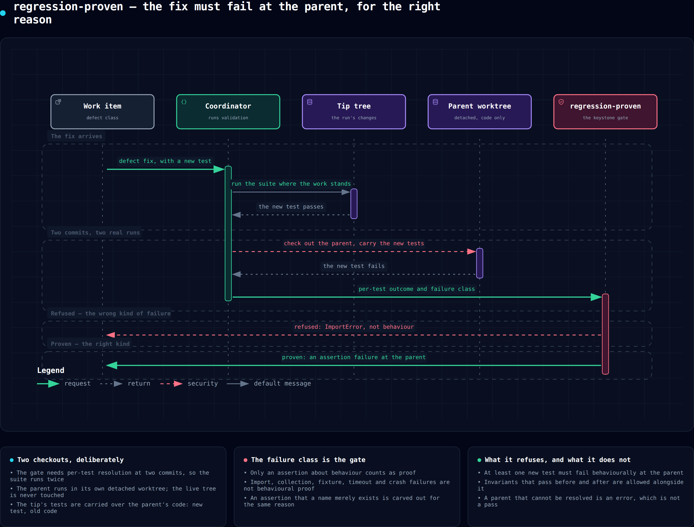
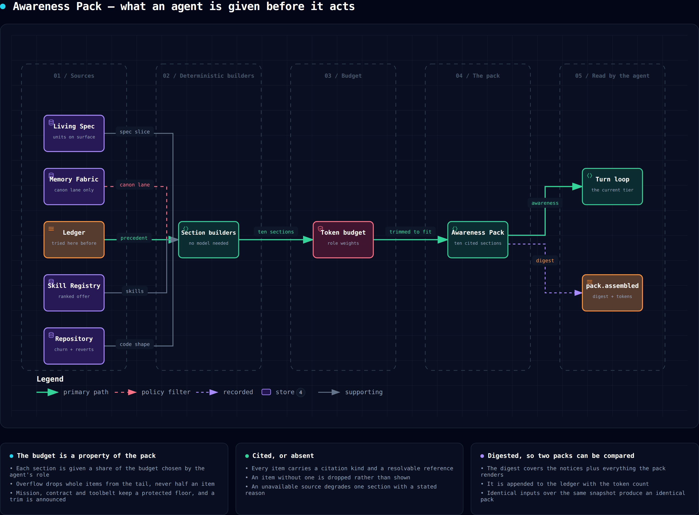
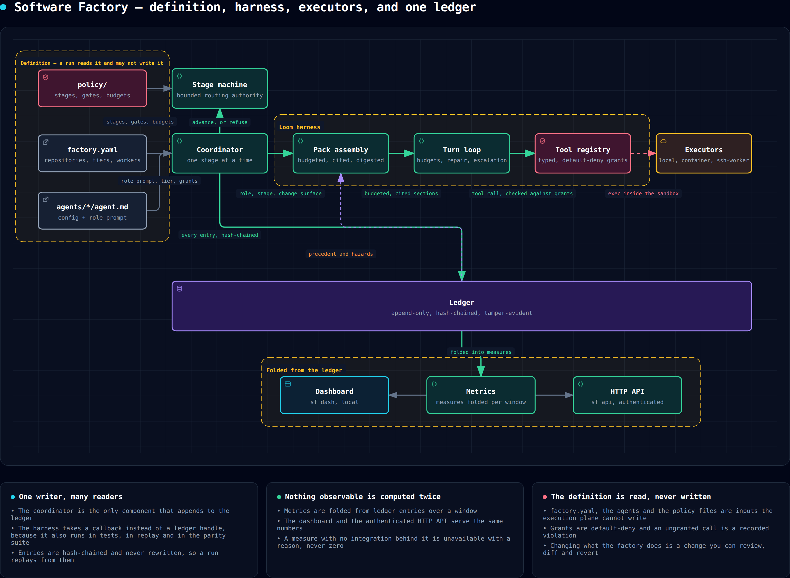
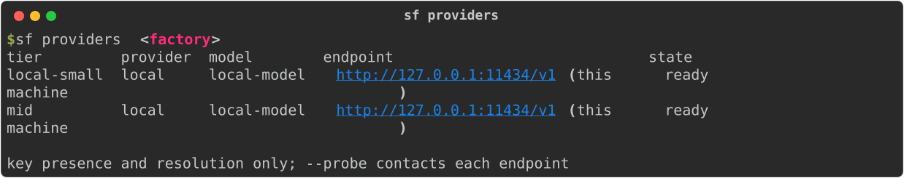
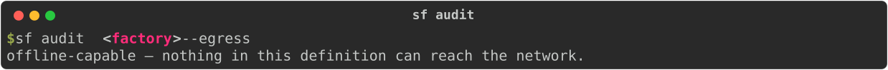
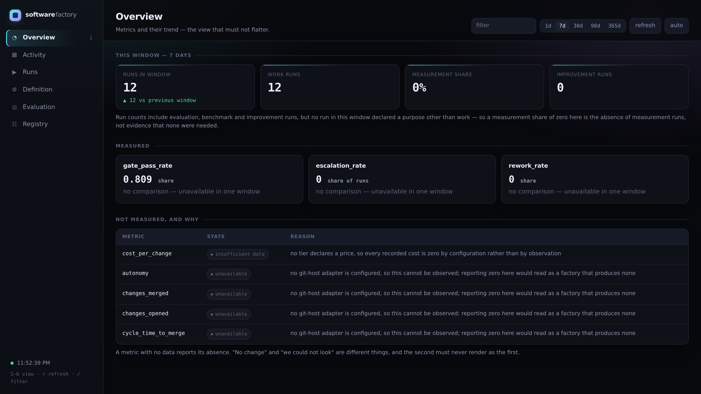

# Software Factory

**Hand it a bug report. Get back a branch with the fix, a test that proves the fix, and a
record of every decision — or a refusal that tells you exactly what is missing.**

The refusal is the point. Anything can produce a diff. This is built to know when its own
work is not good enough to hand you, and to say so.

## What is this, in plain words?

You describe a piece of work in plain language — *"the CSV importer mangles BOM
headers"*. A team of specialist AI workers picks it up: one decides what the request
really is, one plans the change, one writes the code, and one does nothing but try to
prove the others wrong. It runs on **your** hardware — a laptop is fine — under rules
you can read, change, and diff like any other file.

Then the part nothing else does. Before any work reaches you, it must pass a series of
automatic checks called [gates](docs/reference/gates.md). If the evidence is not there —
say, nobody *demonstrated* the bug was real before fixing it — the factory refuses, and
tells you exactly what would change its mind. You never again review a plausible-looking
change blind.

You do not need to be a developer to follow what happens next. Everything below is a
story you can read or a button you can press; the machinery only appears if you go
looking for it.

## Watch one run

A real work item, run against a small hosted model on a real repository. This is
`sf work`'s own output, not a mock-up:

```console
$ sf work "Add a --version flag that prints the package version and exits 0" \
    --factory ./myfactory --repo ~/code/jsonlint

  ok   TRIAGE   scout
  ok   DESIGN   architect
  ok   BUILD    builder
  ok   REVIEW   critic
  ok   HANDOFF  handoff

HANDOFF — 4 file(s) changed
```

**Twenty-four gate evaluations** ran across those five stages. Twenty-three passed.
`regression-proven` reported `skip`, correctly: this is a feature, not a defect fix, so
there is no bug to demonstrate. What landed includes **a test file the factory wrote
itself** — including cases nobody asked for, like asserting the version is read at
runtime rather than hard-coded.

[](docs/diagrams/stage-machine.workflow.html)

<sub>**A work item, intake to handoff.** Gates sit between stages; a blocked item stops
and carries the exact action that would clear it. Defect-class work skips DESIGN.
[Open the interactive version ↗](docs/diagrams/stage-machine.workflow.html)</sub>

## Sixty seconds

```bash
pip install -e ".[dev]"
sf init myfactory --name payments --owner acme --repo payments-service
sf work "The CSV importer mangles BOM headers" --factory myfactory --repo ~/code/payments --dry-run
```

That prints the stages the work item would take and why, without spending anything. To
run it for real, point the factory at a model — any OpenAI-compatible endpoint, local or
hosted:

```bash
# a local runner: nothing leaves the machine, no key
export SF_PROVIDER=ollama
sf work "The CSV importer mangles BOM headers" --factory myfactory --repo ~/code/payments

# or any hosted endpoint
export SF_PROVIDER=openai-compatible
export SF_PROVIDER_ENDPOINT=https://your-host/v1
export SF_PROVIDER_API_KEY=...          # never a flag: `ps` shows flags to every process
```

`sf providers` says what a definition will actually call and whether it can right now.
`sf doctor` says what this machine can and cannot do — a sandbox, a browser, a container
runtime — before a run finds out the expensive way.

Everything below runs against the tree `sf init` just wrote. Nothing needs an account.

## Is this for you?

**Probably yes, if** you have more incoming work than people to do it, you want it done
on your own hardware or your own cloud account, and you would rather have a machine
refuse than hand you a plausible diff you have to check by hand.

**Probably not, if** you want one agent you chat with interactively. This is a fleet
that runs work items to completion and reports; it is closer to CI than to a pair
programmer. Use a coding agent for that, and point this at the backlog behind it.

## The refusal, explained

Ask it to fix a defect without demonstrating the bug:

```console
  stop BUILD    builder
       · the parent-commit failure is about behaviour at tests/test_importer.py::test_bom:
         observed import_error failure; expected an assertion failure

blocked (gate_failed_terminal): The test failed before its body ran, so it proves the code
did not exist, not that the behaviour was wrong. Assert on behaviour that the parent commit
gets wrong.
```

It has the fix. It will not hand it over.

And read what it refused on. The test *did* fail before the change and *did* pass after
— the one-line check most people would write. It failed with an `ImportError`, which
proves the module was missing, not that the bug was real. **The gate reads the failure's
class, not its existence.** That distinction is the product.

[](docs/diagrams/regression-proven.sequence.html)

<sub>**Why it refuses.** The suite runs twice — once where the work stands, once at the
parent in its own detached worktree, carrying the new tests over the old code. Only an
assertion *about behaviour* counts. `assert hasattr(mod, "new_fn")` fails at the parent
with a real `AssertionError` and proves only that the name did not exist: the same
bypass an import error gives, one keystroke away, and refused for the same reason.
[Open the interactive version ↗](docs/diagrams/regression-proven.sequence.html)</sub>

<details>
<summary><strong>How is this different from just running a coding agent?</strong></summary>

A coding agent is a model with tools. This is the machinery you would have to build
around one before you could leave it alone with your backlog:

| | A coding agent | This |
| --- | --- | --- |
| **Knows when it is wrong** | you review the diff | gates block the handoff, and name what would clear them |
| **Proof a fix works** | it says so | a test that failed at the parent commit, for the right reason |
| **What it was told** | whatever fit in context | a budgeted, cited pack, assembled deterministically |
| **What it may touch** | whatever you allow | a declared blast radius, checked by machine |
| **What it cost** | your usage page | per run, per stage, per agent, folded from an append-only ledger |
| **When data is missing** | a plausible number | `unavailable`, with the reason. Never zero |
| **Where it runs** | somebody's cloud | the same files on your laptop, your box, or your cloud |

**Local-first is not a degraded mode.** The same definition files, the same harness and
the same guarantees run on a laptop with a local model as in a data centre. CI proves
the whole suite passes with the network denied. No control plane you don't own.

</details>

<details>
<summary><strong>A tour, in commands</strong></summary>

**See the work.** `sf work` carries one request through triage, design, build, review
and handoff. `sf agent lifecycle` shows every run's state and — the column that matters
— which agents are waiting on a question nobody answered. A run can be `running` and
healthy, or `running` and stalled, and only a view showing both can tell them apart.

```bash
sf work "Reject duplicate keys" --factory myfactory --repo ~/code/jsonlint
sf agent lifecycle --state myfactory/.factory
sf agent send reviewer "prefer the stdlib codecs module" --state myfactory/.factory
```

**Run several agents at once.** Five named patterns over one engine — fan-out/fan-in, a
dependency graph, a swarm, a critic, a supervisor with workers. Every one is a dry run
unless you add `--execute`, because a plan is the one command whose cost is multiplied
by a number you typed.

```bash
sf orchestrate fan-out "audit auth" "audit parsing" "audit export" --join quorum --quorum 2
sf orchestrate swarm "make the parser handle BOMs" --attempts 3
sf orchestrate critic "write the migration" "check it is reversible" \
    --producer builder --reviewer architect
```

A swarm is scored, never raced: first-past-the-post selects for speed, and the fastest
answer is the one that did the least work. A critic may not be the producer.

**Send work to the machine that can run it.** Work declares labels it needs; workers
declare labels they have. A requirement nothing satisfies is refused *by name* — never
downgraded to whatever is free, because work that asked for a GPU and ran on a CPU box
produces results that are wrong rather than missing.

```bash
sf worker list --root myfactory
sf worker route --requires gpu --requires linux    # would it place? without claiming a slot
sf worker leases --root myfactory                  # who holds what, and what expired
```

**Read the past back.** `sf mine` reads completed runs for things worth keeping: a gate
finding that keeps recurring, a question one agent keeps asking and the answer it keeps
getting, a tool sequence nothing has named. It proposes and writes nothing — admission
control lives in the memory store, and a miner that wrote would be a second door with
none of it behind it.

```bash
sf mine --state myfactory/.factory
sf spec template --repo ~/code/jsonlint     # the unit shape that fits *this* repository
sf media read call.vtt                      # a recording as research: untrusted, quoted
```

**Watch the whole thing.** `sf dash` serves a dashboard from the ledger; `sf api` serves
the same numbers over authenticated HTTP; `sf workspace audit` answers the question an
operator running several factories actually has.

```bash
sf dash --state myfactory/.factory
sf workspace audit --root ~/factories       # broken? drifting? who is the outlier?
sf experiment status                        # what the central bet has actually been shown
```

`sf experiment status` reports `insufficient_data — no trials recorded`, which is the
true state of this project's central claim today. A test asserts it cannot report
`supported` without trials behind it.

### What's in a definition

```
factory.yaml               repositories, tier ladder, execution defaults, workers
agents/<name>/agent.md     frontmatter config, Markdown body as the role prompt
automations/               what starts work, and the filters that decide which events
runners/                   the compute a run executes on
scorers/                   sampling classifiers over completed runs
skills/                    versioned procedures agents can load
policy/                    stages, gates, budgets, memory policy
```

`sf init` writes a definition that validates and lints with **zero warnings**, offline,
with no account. CI checks that on every run, because a scaffold that emits warnings
teaches every new user that warnings are normal.

Everything the factory does is described by these files, so changing its behaviour is a
change you can review, diff, and revert — including changes the factory proposes to
itself.

</details>

<details>
<summary><strong>The bet: a modest model in an excellent harness beats a frontier model in a poor one</strong></summary>

Most agent platforms treat the model as the product and the scaffolding as plumbing.
This inverts that — and it is a hypothesis, not a slogan. [§11.2 of the
PRD](docs/PRD.md) is the pre-registered experiment written to falsify it, and
`sf experiment status` reports what it has actually shown so far:

```console
$ sf experiment status
insufficient_data — no trials recorded
```

No trials have run. A test in the suite asserts this cannot report `supported` without
them. Every subsystem below exists because that claim depends on it — and if an ablation
ever shows one of them earning nothing, the protocol says it is removed, not kept for
plausibility.

| | What the agent gets |
| --- | --- |
| **Awareness** | A budgeted, cited, deterministically-assembled context pack: the spec slice that governs the change, the shape of the code, what was tried here before, what breaks around here. It retrieves rather than remembers. |
| **Tools** | A typed registry where deterministic tools replace guesswork. Anything computable *is* computed; the model is spent on judgement. |
| **Confidence** | Calibration scored against outcomes. Confidence with no cited evidence is rewritten to zero before anything downstream reads it. |
| **Courage** | A machine-checked blast-radius contract, stated affirmatively. An agent that doesn't know undo is free picks the timid approach every time. |
| **Quality** | Gates that block, and evidence that resolves claims rather than accompanying them. |

[](docs/diagrams/awareness-pack.dataflow.html)

<sub>**What the agent is given.** Five sources, assembled by builders that need no
model, cut to a token budget by role, every item cited or dropped. Mission, contract and
toolbelt keep a protected floor; overflow drops whole items from the tail, never half of
one. The pack is digested, so identical inputs over the same snapshot produce an
identical pack. [Open the interactive version ↗](docs/diagrams/awareness-pack.dataflow.html)</sub>

</details>

<details>
<summary><strong>How it fits together: the five subsystems</strong></summary>

[](docs/diagrams/architecture.architecture.html)

<sub>**The system.** Definition files describe it; the coordinator carries work items
through the stage machine; the harness assembles a pack and runs the turn loop against a
typed tool registry; executors run commands under a sandbox. Everything observable —
metrics, the dashboard, the HTTP API — is folded from one append-only, hash-chained
ledger rather than kept beside it.
[Open the interactive version ↗](docs/diagrams/architecture.architecture.html)</sub>

Each subsystem has a design document and a test matrix it satisfies.

| Subsystem | Design | The idea in one line |
| --- | --- | --- |
| **Living Spec + Delta** | [`living-spec.md`](docs/harness/living-spec.md) | Intent that can block a build, because drift is a digest comparison rather than a model's opinion. |
| **Memory Fabric** | [`memory.md`](docs/harness/memory.md) | Four lanes with earned promotion, transitive poisoning containment, and an eight-stage retrieval filter. |
| **Skill lifecycle** | [`skills.md`](docs/harness/skills.md) | Promote, evolve, merge, split, sunset — all evidence-gated, because a library that only grows becomes a junk drawer. |
| **Evals + gates** | [`evals.md`](docs/harness/evals.md) | Gates block one run, scorers sample many, benchmarks compare configurations. Conflating them is how assurance becomes theatre. |
| **Loom harness** | [`HARNESS.md`](docs/harness/HARNESS.md) | Packs, tools, contracts, and an escalation ladder that requires a recorded trigger. |

</details>

<details>
<summary><strong>Status: what exists, honestly</strong></summary>

Under construction, and specific about where. What exists and is tested:

| | |
| --- | --- |
| Definition layer | Loader, whole-tree atomic validation, cross-file lint, inheritance resolution, JSON Schema export |
| Ledger | Append-only, hash-chained, tamper-evident, with sealed segments anchored back into the log |
| Living Spec | Content-addressed anchors, five agreement states, deltas with impact reports |
| Memory Fabric | Admission control, source-disjoint promotion, policy pass, retrieval pipeline |
| Skill registry | Selection quality metrics and all five lifecycle operations |
| Assurance | Baseline gates including `regression-proven`, evidence bundles, scorers, benchmarks |
| Harness | Pack assembly, typed tool registry with grant enforcement, blast radius, routing ladder, turn loop |
| Providers | Two adapters covering local runtimes (Ollama, llama.cpp, vLLM, LM Studio) and hosted APIs |
| Executors | Local (bwrap/sandbox-exec), container, and ssh-worker, with a parity suite |
| Orchestrator | Work items, stage machine with bounded routing authority, per-stage transitions |
| Identity | Principals, capabilities, separation of duties, human checkpoints |
| Economics | Spend caps that stop intake and halt work, backpressure, fair scheduling |
| Governance | Data classes, retention, subject erasure with an honest receipt |
| Observability | Metrics folded from the ledger, a local dashboard, and an authenticated HTTP API |
| Integrations | A chat adapter and a git-host adapter, both replayable offline from a saved delivery |
| Scheduling | Cron triggers that actually fire, with a missed window firing once rather than once per occurrence |
| Workspaces | More than one factory in one tree, with cross-factory validation and metrics |
| Computer use | A `UI` effect class, a session contract, declared `ui.*` tools, and a mandatory recording |
| Messaging | Agents address each other through the ledger, so a message and the run it is about cannot be observed out of order |
| Worker routing | Work declares labels, workers declare labels, leases are counted on disk and reclaimed when they expire |
| Orchestration | Fan-out/fan-in, DAG, swarm, critic and supervisor — five constructors over one validated engine |
| The experiment | PRD §11.2's protocol: a registration that locks at the first trial, Holm-corrected primaries, and a verdict that can be `falsified` |
| Mining | Completed runs read back for candidate memories and skills, with corroboration counted over distinct sources |
| Templates | Spec unit shapes derived from the repository, with sections the repository cannot support marked rather than dropped |
| Cross-factory | One audit over a workspace: what is broken, what is drifting, and who is the outlier |

**Honestly not there yet.** The behavioural half of the executor parity suite skips
without a container daemon and a reachable worker, and says so rather than passing. The
§11.2 experiment has its full protocol and **no trials**: `sf experiment status` reports
`insufficient_data`, which is the honest state of the project's central claim and the
thing most worth fixing next. No provider is exercised against a live endpoint *in CI* —
the suite drives real providers over a real socket against a server speaking the hosts'
wire formats, which is the strongest claim a suite can make on its own, and
`scripts/live_trial.py` and `scripts/product_trial.py` are the two commands that go
further. See the [milestone plan](docs/PRD.md).

</details>

<details>
<summary><strong>Does it work? The trials</strong></summary>

Three end-to-end trials run the factory over real repositories — real git history, the
repository's own pytest suite, real diffs, and gates evaluating the actual result. The
report is generated: [`docs/trials.md`](docs/trials.md), regenerated by
`python scripts/run_trials.py`, and CI fails if the committed one has drifted.

| Trial | What it asks |
| --- | --- |
| Greenfield | On a repository with no tests, no build and no history, does the factory report what it could not verify, or does it report success? |
| Brownfield | With a real suite and a real defect, does `regression-proven` block a fix nobody demonstrated, and pass one that a real run at the parent commit actually fails? |
| Adversarial | A test that fails at the parent with an `ImportError` and passes at the tip satisfies "fails before, passes after". Does the gate read the failure's *class*, or only its existence? |

The answers are yes, yes, and yes — and writing the trials is what produced them. Before
these ran, the coordinator supplied `has_test_command=False` and `build_ok=True` as
constants, so the keystone gate had never once compared a real test run at the tip
against a real one at the parent. It blocked a fix with no test for the weaker reason
that no evidence existed at all.

**The model is scripted in all three**, deliberately: a suite that needs a live model is
a suite nobody runs. The trials establish that *given* an output, the factory does the
right thing with it.

### And then it met a model that was not scripted

`scripts/live_trial.py` runs one real work item through a real endpoint. Five runs
against a small hosted model found **four defects in the keystone gate alone** — none of
which 1,400 tests had caught, every one of them in the same direction: *the gate refused
correct work.*

| What the model did | What the factory said | What was actually wrong |
| --- | --- | --- |
| Fixed the defect, wrote five tests | "Write the test first, and watch it fail" | `base_commit` was declared and written by nothing, so the gate compared against a commit that does not exist in a one-commit repository |
| Wrote descriptive test names | "The test failed before its body ran" | The failure class was read from a line the test runner truncates to terminal width, so the *length of a test's name* decided whether it counted |
| Wrote a regression test and an invariant | "This test proves nothing" | The gate required *every* new test to fail at the parent, punishing the practice it exists to encourage |
| Emitted one literal tab inside JSON | Run over | A malformed tool call discarded a 29-turn build that had already passed every gate |

Between the second and third fixes, a run passed `regression-proven` outright. And on
one run the gate refused a test for exactly the right reason — *"it proves the code did
not exist, not that the behaviour was wrong"* — which is FR-13.3a working in the wild.

The finding worth carrying is not any of the four. It is that **a harness is not
verified by its own authors' tests**: every test in the suite was written by somebody
who already knew what the gate meant, so none of them could disagree with it.

### And then it built something

One work item is the smallest honest claim, and not the interesting one. A factory is a
thing you use for months, and what decides whether it is usable is the second, fifth and
twentieth change. `scripts/product_trial.py` builds a real JSON validator through a
sequence of work items chosen to probe where a factory actually fails:

| Step | What it probes | What the factory getting it wrong looks like |
| --- | --- | --- |
| A `--version` flag | a change too small to justify ceremony | spending as much as the largest step — a factory whose floor cost is its ceiling cost is unusable for the changes people make most often |
| Line and column in errors | a large change to an existing public API | breaking the old signature, or reaching handoff with the new surface untested |
| "Make the errors better" | a request with nothing checkable in it | quietly guessing and reaching handoff — an unfalsifiable change nobody asked for |
| Reject duplicate keys | `regression-proven` on a genuine defect | handing off with a test that passed before the change |
| A planted trailing-comma bug | recovery in code the factory already touched | fixing it by reverting the file, which passes the new test and deletes every previous change |
| Split parsing from reporting | a change that must alter structure and nothing else | changing behaviour under cover of a refactor, which no test names |

Every step's expectation **and its falsifier** are written down before the run and
printed beside the result, because deciding afterwards what a run was testing is how
every trial comes out a success. The report is
[`docs/product-trial.md`](docs/product-trial.md).

</details>

## What it looks like

`sf providers` answers the question a definition cannot: *what will this factory
actually call, and can it right now?* Offline unless `--probe` is passed — a diagnostic
that needs the network to report a network problem is not one.



`sf audit --egress` enumerates every outbound destination reachable from the definition,
including the ones it **cannot** determine. A report that silently omits what it cannot
see is worse than none, because it reads as a complete list.



`sf dash` serves a local dashboard from the ledger. The interesting column is the one
full of prose: a metric that needs an integration this factory does not have is
*unavailable with a reason*, never zero — and `cost_per_change` says the recorded zeros
come from a ladder that declares no prices, rather than reporting a factory that runs
for free.



Every image here is regenerated by `python scripts/capture_screenshots.py` from a real
run, for the same reason `docs/reference/` is generated: a screenshot captured by hand
goes stale silently, and a stale screenshot of a CLI shows output the tool no longer
produces.

## Reviews

The design was reviewed adversarially before it was implemented and the code twice
after, and the reports are kept unedited in [`docs/reviews/`](docs/reviews) — including
the findings we **declined** to act on, because a review record that preserves only the
accepted findings is not a review record.

Two patterns account for most of what the reviews found, and both are worth stating
plainly: **a control that exists and is never called** — nine of the first round's
eleven critical findings had that shape — and **a defect held in place by a test that
asserted it** — six of them, including a test named
`test_secrets_are_passed_by_environment_not_on_the_command_line` whose assertion
required that they *were* on the command line.

Three design findings changed the design materially:

- `regression-proven` was satisfiable by an import error at the parent commit — the
  one-line bypass that a small model produces by default.
- Memory corroboration was defined over *runs*, so two agents reading the same planted
  issue comment laundered untrusted text into canon.
- The acceptance experiment had strawman controls and exempted exactly the criteria most
  likely to fail.

[Appendix C of the PRD](docs/PRD.md) maps every finding to its disposition.

## Decisions

The choices that would be expensive to reverse are recorded in
[`docs/adr/`](docs/adr), each with the condition that would change our mind. A decision
with no falsification condition is a preference.

## Development

```bash
ruff format . && ruff check . && mypy && pytest
python scripts/run_offline_tests.py   # the whole suite, with the network denied
```

All four must be clean. See [CONTRIBUTING.md](CONTRIBUTING.md) for the standing
positions you'd otherwise discover in review, and [SECURITY.md](SECURITY.md) for the
threat model — including what it does **not** defend against.

## License

Apache License 2.0 — see [LICENSE](LICENSE) and [NOTICE](NOTICE).
