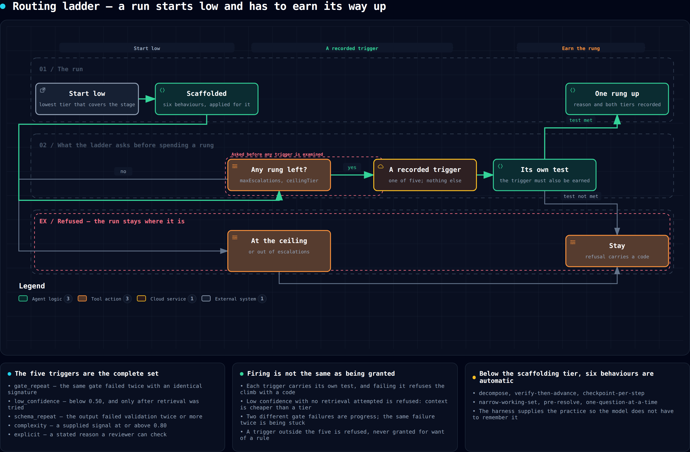

# Loom — Agent Harness Specification

| Field | Value |
| --- | --- |
| Component | `loom` — the agent harness |
| Version | 1.0.0 |
| Status | Design baseline |
| Implements | PRD FR-9, FR-10, FR-11, FR-12 |

> The harness is the product. This document specifies it precisely enough that two independent
> implementations would behave identically on the same inputs.

---

## 1. What a harness is, here

A harness is everything between "a work item needs doing" and "a model produced a token". Most
harnesses are a prompt template and a tool-call loop. This one is a **contract-bearing runtime** with
seven responsibilities:

| # | Responsibility | Spec |
| --- | --- | --- |
| 1 | Assemble what the agent knows | [awareness.md](awareness.md) |
| 2 | Offer what the agent can do, typed | §4 Tool Registry |
| 3 | Bound what the agent may affect, checkably | §5 Blast radius |
| 4 | Drive the turn loop under budget | §6 Turn loop |
| 5 | Validate what the agent produced, structurally | §7 Output contracts |
| 6 | Route effort to the cheapest tier that works | §8 Routing ladder |
| 7 | Record everything, verifiably | §9 Ledger integration |

Everything else — orchestration, integrations, dashboards — sits outside the harness and talks to it
through §3's interface.

## 2. The design stance

### 2.1 Five properties, and the mechanism for each

| Property | Not achieved by | Achieved by |
| --- | --- | --- |
| **Awareness** | A bigger context window | A budgeted, cited, deterministically-assembled pack with on-demand retrieval behind every section |
| **Creativity** | Prompting for creativity | Cheap speculation: checkpointed branches an agent can try and discard, with rejected alternatives kept as evidence |
| **Confidence** | Asking the model how sure it is | Calibration scored against outcomes, with uncited confidence treated as zero |
| **Courage** | Permissive defaults | A machine-checked blast-radius contract stated affirmatively, so the agent knows exactly what undo costs |
| **Quality** | A better model | Gates that block, evidence that resolves claims, and a reviewer configured not to share the builder's blind spots |

### 2.2 Why a small model does well here

A small model's failure modes are specific and each has a structural answer:

| Small-model failure | Structural answer | Spec |
| --- | --- | --- |
| Forgets or misremembers project facts | Never asked to remember; every fact is retrieved and cited | awareness.md §3 |
| Loses the thread over long tasks | Task decomposed into verified steps with checkpoints between | §8.4 |
| Produces malformed structured output | Schema validation with bounded repair, error fed back verbatim | §7 |
| Hallucinates APIs and symbols | Symbol lookup is a deterministic tool; unresolved symbols fail a gate | §4.3 |
| Claims success without checking | `evidence-complete` and `tests-pass` gates; claims must resolve to artifacts | evals.md §3 |
| Overconfident when wrong | Calibration required, scored, and fed back into routing | §8.5 |
| Degrades as context fills | Working-set budget enforced per tier, with compaction at declared thresholds | §6.4 |
| Cannot judge its own work | Review is a different agent on a different model and harness | PRD FR-3.5 |

None of these answers is "use a bigger model". Each is a mechanism the harness owns.

### 2.3 Fool-proof and fail-proof

Two distinct commitments, deliberately separated:

- **Fool-proof** — the harness cannot be *misconfigured into unsafety*. Grants are default-deny;
  every capability is declared in files the execution plane cannot write; misconfiguration fails
  validation rather than degrading silently; and there is no ambient authority anywhere.
- **Fail-proof** — the harness cannot *fail silently*. Every loop is bounded; every failure is typed
  and recorded; every partial result is labelled partial; every degradation is announced. The system
  is permitted to do less. It is never permitted to pretend it did more.

The invariant behind both: **it is always better to stop with a stated reason than to continue with
an unstated assumption.**

---

## 3. Harness interface

The orchestrator's only view of the harness. Implementations are interchangeable behind it.

```
RunRequest {
  run_id, work_item_id, stage, agent_config,
  pack: AwarenessPack,
  contract: BlastRadiusContract,
  budget: Budget,
  output_schema: JSONSchema,
  workspace: WorkspaceHandle,
  ledger: LedgerHandle,
}

RunResult {
  status: completed | gate_failed | budget_exceeded | contract_violation
        | provider_failed | cancelled | setup_failed,
  output: <validated against output_schema>   # absent unless status == completed
  calibration: CalibrationStatement,
  evidence: [EvidenceRef],
  usage: Usage,                                # tokens, tool calls, wall clock, cost
  escalations: [EscalationRecord],
  violations: [ViolationRecord],
  memory_candidates: [MemoryCandidate],
  spec_delta: SpecDelta | null,
  transcript_ref: EvidenceRef,
  reason: string | null,                       # required when status != completed
}
```

**H-1** — `RunResult.status != completed` ⟹ `reason` is non-empty and machine-classifiable.
**H-2** — `status == completed` ⟹ `output` validates against `output_schema` and `calibration` is present.
**H-3** — The harness never mutates anything outside `workspace` except through `external`-class tools,
which are ledger-recorded before execution.
**H-4** — The harness is pure with respect to the definition: it reads configuration, never writes it.

---

## 4. Tool Registry

### 4.1 Tool descriptor

```
Tool {
  name, description,
  input_schema, output_schema,           # JSON Schema, both required
  effect: read | write | exec | network | external,
  cost_class: free | cheap | moderate | expensive,
  idempotent: bool,
  timeout_ms: int,
  requires_grant: [GrantName],
  examples: [ {input, output} ],         # at least one, shown in the pack
}
```

**T-1** — A tool without both schemas and at least one worked example may not be exposed.
**T-2** — Effect class determines audit and contract rules; it is not advisory.
**T-3** — Grants are resolved from agent configuration only. An ungranted call is refused and recorded
as a violation — it does not return an error the model can route around.
**T-4** — Results are structured. Where a native tool emits human-oriented text, the adapter parses it
into the declared schema, and a parse failure is a typed tool failure, not passed through as prose.
**T-5** — Every call is ledger-recorded: name, input digest, duration, outcome, cost class, effect.

### 4.2 Failure envelope

Every tool returns one of:

```
Ok { value }
Failed { kind: not_found | invalid_input | denied | timeout | conflict
             | unavailable | truncated | internal,
         message, remediation, partial? }
```

**T-6** — `truncated` and `partial` are explicit fields. Silent truncation is a defect.
**T-7** — `remediation` states the next action in imperative form.

### 4.3 Baseline tools

Deterministic reads (PR-6 — the model must never infer these):

| Tool | Returns |
| --- | --- |
| `repo.search` | Ranked, located matches with context |
| `repo.symbol` | Definition, references, signature, type |
| `repo.read` | File content by byte or line range |
| `repo.graph` | Module and dependency edges around a surface |
| `repo.history` | Commits, authors, and churn for a path |
| `repo.blame` | Line provenance |
| `test.discover` | Test topology: which tests cover which paths |
| `spec.get` | Spec units by id or by anchor intersection |
| `memory.query` | Scoped, lane-filtered memory retrieval |
| `ledger.query` | Prior runs, findings, and outcomes for a surface |
| `ci.status` | Structured check results for a ref |

Writes and execution:

| Tool | Effect |
| --- | --- |
| `patch.apply` | `write` — applies a diff with conflict detection |
| `file.write` | `write` |
| `test.run` | `exec` — structured per-test results |
| `build.run` | `exec` |
| `fmt.run` / `lint.run` | `exec` |
| `proc.run` | `exec` — under the runner's policy |
| `checkpoint.create` / `checkpoint.restore` | `write` — see §5 |

External (permission-gated, never speculative):

| Tool | Effect |
| --- | --- |
| `source.comment` | `external` |
| `change.open` / `change.update` | `external` |
| `tracker.update` | `external` |
| `evidence.attach` | `external` |

**T-8** — `test.run` returns per-test outcome, duration, and failure detail. A pass/fail boolean is
insufficient: the `regression-proven` gate needs per-test resolution at two commits.

---

## 5. Blast radius and checkpoints

### 5.1 Contract

```
BlastRadiusContract {
  writable_paths: [glob],          # default: workspace only
  effects_allowed: [effect],       # default: [read, write, exec]
  external_actions: [action],      # default: []
  network: none | allowlist | open,
  network_allowlist: [host],
  ceilings: { cpu, memory_mb, disk_mb, wall_clock_s, tool_calls },
  undo: { checkpoints: bool, granularity: run | step },
}
```

**B-1** — The executor enforces the contract. The prompt states it; the prompt does not implement it.
**B-2** — A denied action is recorded as a `ViolationRecord` with the attempted operation, the rule
that denied it, and the surrounding turn. Denial is silent to no one.
**B-3** — The contract is presented to the agent **affirmatively** — what it may do, and what undo
costs — because the purpose is to license bold approaches inside a safe envelope, not to intimidate.

### 5.2 Checkpoints and speculation

**B-4** — A checkpoint is taken before the run (`C0`) and at every declared step boundary.
**B-5** — `checkpoint.restore` is available to the agent itself. Rolling back is a normal move, not a
failure, and is recorded as such.
**B-6** — A speculative branch is: `checkpoint.create` → attempt → evaluate against gates → keep or
`checkpoint.restore`. Speculation may not perform `external` effects. Discarded branches are recorded
and surface in the evidence bundle as considered-and-rejected alternatives, with the reason.
**B-7** — Speculation is budgeted separately from the main line, so an agent cannot exhaust its budget
exploring.

### 5.3 The courage clause

An agent's pack contains, verbatim and machine-derived from the contract:

> You may modify anything under `{writable_paths}`. A checkpoint was taken before this run and at each
> step boundary; `checkpoint.restore` returns the workspace exactly to any of them, and doing so costs
> nothing and counts against no quality measure. Nothing you do inside this workspace is visible
> outside it until an `external` action, and the external actions available to you this run are
> `{external_actions}`. Therefore: prefer the approach you believe is right over the approach that is
> merely safe, try the alternative you are unsure about, and record what you rejected and why.

**B-8** — This clause is generated from the enforced contract, never hand-written per agent, so it can
never overstate the agent's actual freedom.

---

## 6. Turn loop

### 6.1 Shape

```
state = { pack, working_set, budget, tier, step }
loop:
  1. compose prompt: role body | policy | pack | working set | task | contract
  2. call model at current tier
  3. if the turn carried nothing usable: diagnose it (truncated | filtered | empty) and advise (§7 O-3.1)
  4. if tool calls: validate grant → check contract → dispatch → record → append results
  5. if final: validate against output_schema (§7)
  6. check budget; check compaction threshold (§6.4)
  7. check escalation triggers (§8.3)
until final-and-valid | budget_exceeded | contract_violation | cancelled
```

### 6.2 Prompt composition order

Fixed, delimited, and tested. Later sections may not silently override earlier ones.

| Order | Section | Trust | Delimiter |
| --- | --- | --- | --- |
| 1 | Harness invariants | system | `<harness>` |
| 2 | Policy (gates, checkpoints, contract, courage clause) | system | `<policy>` |
| 3 | Agent role body | operator | `<role>` |
| 4 | Skills offered | operator | `<skills>` |
| 5 | Awareness Pack | mixed, per-item labelled | `<awareness>` |
| 6 | Working set | derived | `<working>` |
| 7 | Task text and source context | **untrusted** | `<task untrusted="true">` |

**L-1** — Content originating outside the definition (issue text, comments, file content, tool-server
descriptions, model output from another run) is always inside an `untrusted="true"` region.
**L-2** — The harness refuses any tool call whose arguments were sourced from an untrusted region and
that targets a grant boundary — a secret name, a policy path, a definition file — without an explicit
human decision. This is a structural defence, not a prompt instruction.
**L-3** — Delimiters are not user-controllable; occurrences in content are escaped.

### 6.3 Budget enforcement

**L-4** — Four independent budgets: wall clock, tool calls, tokens, cost. Whichever binds first ends
the run with `budget_exceeded`, a sealed partial evidence bundle, and a Conductor decision point.
**L-5** — At 80% of any budget the harness injects a single, clearly-labelled notice so the agent can
land the work rather than being cut off mid-edit. This notice is not a request to hurry; it states the
remaining budget and asks for the best stopping point.

### 6.4 Working-set management

**L-6** — The working set has a tier-specific ceiling, below the model's nominal window, because
quality degrades before the window is full.
**L-7** — At the compaction threshold the harness compacts: tool results older than the current step
are replaced by a structured digest plus a retrieval handle; the pack's cited sections are never
compacted away, only their bodies (the citation remains, retrievable).
**L-8** — Compaction is recorded, with what was compacted and its handle. An agent may always re-fetch.
**L-9** — Compaction must be deterministic given the same inputs.

---

## 7. Output contracts

**O-1** — Every stage declares a JSON Schema for its output. Downstream stages consume the validated
structure; free prose is never a stage's interface.
**O-2** — On validation failure the agent receives the *exact* validation error and a bounded number of
repair attempts (default 3). Each attempt is recorded.
**O-3** — After exhaustion the harness escalates one tier (§8.3) and retries once. After that the run
ends `gate_failed` with the validation errors as findings.
**O-3.1 — A turn that carried no usable answer is diagnosed before it is repaired.** A truncated
answer, a filtered one, and an empty one are three different faults and only one of them is a schema
mistake. Each gets feedback naming *its* fault, and the run that ends on one ends with *its* reason.
Treating them alike is not a cosmetic error: a model told to correct its JSON when its answer was cut
off at the output limit will re-send an answer of the same length and be cut off in the same place, so
the repair budget is spent without a single turn of progress. Every stop reason a provider can report
is acted on here or the enum's promise that the loop acts on all of them is false.
**O-3.2 — A validation error must be findable, not merely exact.** E-13 requires the error verbatim;
verbatim is necessary and not sufficient. `at position 1587` is exact and useless: a model cannot count
to the 1587th character of its own output, so the repair turn goes to guessing. Report the line and
column, and quote the text on either side of the fault. The agent's own text quoted back into a prompt
is escaped like any other untrusted content (L-3) — it is the one region of the prompt the model wrote.
**O-4** — Every output carries a `CalibrationStatement`:

```
CalibrationStatement {
  criteria: [ { criterion_id, confidence: 0..1, evidence: [EvidenceRef], basis: string } ],
  unknowns: [ { question, why_it_matters, who_can_answer } ],
  assumptions: [ { assumption, if_wrong } ],
  overall_confidence: 0..1,
}
```

**O-5** — A criterion with `confidence > 0` and an empty `evidence` list is **rewritten to 0** by the
harness before downstream consumption, and the rewrite is recorded. Uncited confidence is not
confidence.
**O-6** — `unknowns` is not optional and may not be empty by default; an agent claiming zero unknowns
must say why, and that claim is itself scored.
**O-7** — Calibration is compared against outcomes (gate results, review findings, post-merge
reverts). Per-agent calibration error is a first-class metric and a valid improvement target.

---

## 8. Routing ladder

[](../diagrams/routing-ladder.workflow.html)

<sub>**Start low, and earn the rung.** Budget and ceiling are checked before any trigger is
examined; a trigger that fires must still pass its own test; a refusal carries a code. The
five triggers are the complete set — a value outside them is refused, never granted for want
of a rule. [Open the interactive version ↗](../diagrams/routing-ladder.workflow.html)</sub>

### 8.1 Tiers

```
tiers:
  - name: local-small   # runs on operator hardware
  - name: small
  - name: mid
  - name: large
```

Each declares provider, model, context window, effective working-set ceiling, cost, and capability
tags. Agents declare a **starting tier**, not a model, unless deliberately pinned.

A rung may also declare a `harness` and a `runner`, so what a ladder chooses is a
*(harness, model, runner)* triple rather than a model tier alone:

```
  - name: mid
    provider: local
    model: mid-hosted
    harness: codex     # which agent runtime drives the stage; the built-in `loom` when unset
    runner: linux      # which runners/<name>.yaml it executes on; the agent's when unset
```

**R-1b** — A harness is not a model. It decides what the model sees and what it may do: context
assembly, tool set, approval rules, sandbox, and what a finished run emits. Two harnesses on one
model are therefore two engines, which is why the independence checks compare both, and why a
rung that changes harness buys something a larger model cannot supply.

**R-1c** — An agent that pins `harness:` has declared it instead of a tier, so its pin beats the
rung. A rung's `runner` is the other way round: `agentDefaults.runner` is inherited factory-wide,
so the rung is the more specific statement of the two.

**R-1d** — A named harness with no runtime behind it fails the run with `SETUP_FAILED` and says
so. It is never served by the built-in harness instead: a stage that reports Codex and ran `loom`
makes every later comparison between them worthless.

### 8.2 Start low

**R-1** — Default starting tier is the lowest tier whose capability tags cover the stage's declared
requirements. Starting high is an explicit, justified choice recorded in the definition.

### 8.3 Escalation triggers

Escalation requires a recorded trigger. The permitted set:

| Trigger | Condition |
| --- | --- |
| `gate_repeat` | The same gate failed twice with the same failure signature |
| `low_confidence` | Overall calibrated confidence below threshold *after* on-demand retrieval was attempted |
| `schema_repeat` | Output schema validation failed after the repair budget |
| `complexity` | A deterministic complexity signal (surface size, fan-out, cyclomatic delta) exceeded threshold |
| `explicit` | The agent requested escalation and stated why |

**R-2** — Escalation records trigger, tier before and after, and the outcome delta. Without the outcome
delta the factory cannot learn where escalation pays.
**R-3** — Escalation is bounded: at most `max_escalations` per run (default 2), and never past the
factory's declared ceiling tier.
**R-4** — "The model seems to be struggling" is not a trigger. Every trigger is machine-evaluable.

### 8.4 Small-tier scaffolding

Applied automatically when the active tier is at or below `scaffoldAtOrBelow` (default: `small`).

| Scaffold | Behaviour |
| --- | --- |
| **Decompose** | The task is split into steps, each with a deterministic success check, before work begins |
| **Verify-then-advance** | A step's check must pass before the next step starts; a failed check retries that step, not the task |
| **Checkpoint per step** | `checkpoint.create` at every step boundary (B-4) |
| **Narrow the set** | Working-set ceiling reduced to the tier's effective window; compaction threshold lowered |
| **Pre-resolve** | Symbols, paths, and test targets the plan mentions are resolved by tool *before* the step runs; unresolved references stop the step |
| **One question at a time** | Tool offers are filtered to those relevant to the current step |

**R-5** — Every scaffold is individually toggleable and individually measurable. A scaffold that does
not improve benchmark outcomes for its tier must be removed, not kept for plausibility (this is the
FR-14 loop applied to the harness itself).
**R-6** — Scaffolding is never applied silently at higher tiers; it is a tier-conditioned behaviour and
appears in the run record.

### 8.5 De-escalation

**R-7** — Where benchmarks show a task class handled at a lower tier with equal outcome, lowering the
starting tier is a normal improvement proposal with the same evidentiary standard as any other.
Cost reduction is an improvement, not a compromise.

---

## 9. Ledger integration

**G-1** — The harness emits ledger entries for: run start and end, pack digest, every tool call, every
model call with usage, every escalation, every violation, every checkpoint and restore, every
compaction, every repair attempt, and the final calibration.
**G-2** — Entries are hash-chained; the harness never rewrites an entry.
**G-3** — Given a run's ledger entries and its recorded model responses, the run replays deterministically
with models stubbed. Replay divergence is a defect.

---

## 10. Failure taxonomy

| Status | Meaning | Evidence produced | Next |
| --- | --- | --- | --- |
| `completed` | Output produced and schema-valid | Full bundle | Stage gates |
| `gate_failed` | Gates could not be satisfied within the repair budget | Partial bundle + findings | Conductor decides |
| `budget_exceeded` | A budget bound was reached | Partial bundle | Conductor decides |
| `contract_violation` | Blast-radius contract breached | Violation records | Security path |
| `provider_failed` | Inference unavailable after fallbacks | Diagnostic only | Retry or park |
| `setup_failed` | Runner setup failed | Setup transcript | Fix runner |
| `cancelled` | Human stopped it | Partial bundle | — |

**F-1** — There is no `unknown` status. An unclassifiable failure is `internal` and is a defect ticket.
**F-2** — Every non-`completed` status still produces a ledger record and a sealed partial bundle.
**F-3** — No status may be reached by timeout alone without a typed reason (fail-proof, §2.3).

---

## 11. Conformance

An implementation is conformant when it passes:

| Suite | Asserts |
| --- | --- |
| `pack-determinism` | Identical inputs ⟹ identical pack digest, across processes and platforms |
| `grant-enforcement` | Every ungranted tool call is refused and recorded, for every effect class |
| `contract-enforcement` | Every out-of-contract write, network call, and external action is denied |
| `injection-refusal` | Untrusted-region arguments at grant boundaries are refused (L-2) |
| `budget-bounds` | Each budget independently terminates a run with the correct status |
| `output-repair` | Schema failure → bounded repair → escalation → `gate_failed`, in that order |
| `calibration-rewrite` | Uncited confidence is rewritten to zero (O-5) |
| `escalation-triggers` | No escalation occurs without a recorded permitted trigger |
| `checkpoint-fidelity` | Restore returns the workspace byte-identically |
| `replay` | Recorded runs replay deterministically with stubbed models |
| `executor-parity` | Identical results across local, container, and ssh-worker executors |

**C-1** — All eleven suites run offline against a stub provider. A conformance suite requiring network
is not a conformance suite.
